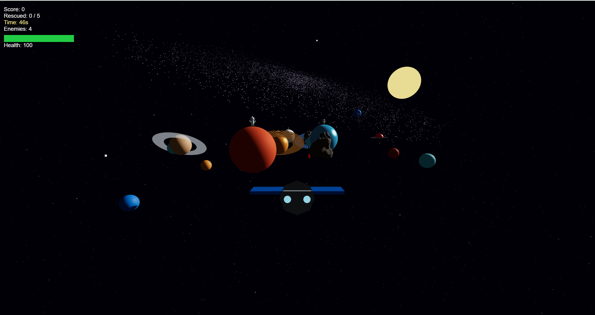

# Astro Rescue 3D

Astro Rescue 3D is an interactive space rescue game built with Three.js and JavaScript. The player pilots a spacecraft through a 3D environment, rescues astronauts, avoids asteroids and planets, collects health and oxygen, and fights enemy ships.

## Live Demo

[Play Astro Rescue 3D](https://celine-ama.github.io/astro-rescue-3d/)

## Gameplay



## Features

- Third-person spacecraft movement and camera controls
- Enemy ships with pursuit, strafing, and shooting behavior
- Player shooting and projectile collision detection
- Planetary gravity using distance-based force calculations
- Collision handling for planets, asteroids, enemies, and collectibles
- Procedurally generated asteroid geometry
- Rescue objectives, scoring, health, timers, and restart systems
- Custom GLSL shader effects for planetary rings
- Dynamic lighting, shadows, stars, and galaxy effects

## Technologies

- JavaScript
- Three.js
- WebGL
- GLSL
- HTML and CSS
- Vite
- Git and GitHub

## Linear Algebra and Graphics Concepts

This project uses vectors, transformation matrices, coordinate systems, camera orientation, interpolation, normalization, distance calculations, and 3D object transformations.

Examples include:

- Calculating movement using forward and right direction vectors
- Applying inverse-square gravitational force between planets and the player
- Rotating and positioning 3D objects
- Computing projectile directions toward targets
- Detecting collisions using sphere distances
- Updating the camera relative to the player

## Controls

- `W / S` — Move forward and backward
- `A / D` — Move left and right
- `Q / E` — Move vertically
- Arrow keys — Rotate the camera
- Right mouse drag — Rotate the camera
- Left click or `Space` — Shoot
- `R` — Reset the camera

## Project Background

This project began as a team computer graphics course project at UCLA. This repository contains a repaired and updated portfolio version. I worked on the game’s visual systems and code. My contributions included implementing collision detection for planets, asteroids, projectiles, astronauts, and collectibles, as well as building the scoring, health, lives, and collectible systems.

## Run Locally

Install the dependencies:

```bash
npm install
